# Intoduction of Graph.
- It's a Non Linear Data Structure.

**Visualation** - It is very easy to visualation comp. to other data structre.

**RealLife-Use** -  Google-Map , linkdin , zomato , ola, Facebok and use for Data Analytics.

**Edges** That represent the realation b/w Vertex/ Nodes.

**Type** - Two Type Directed And UnDirected Graphs
 
 - in undirected graph only bidirection adge are present
 ### Acyclic graph

 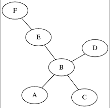

### cyclic graph

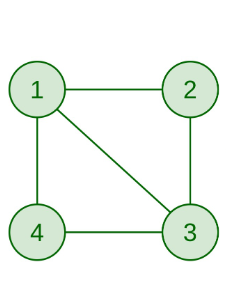
### Directed acyclic graph

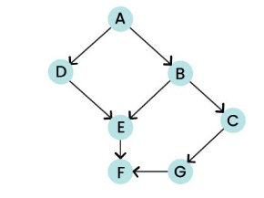

### connected graph

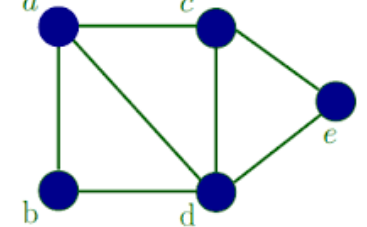

### disconnected graph

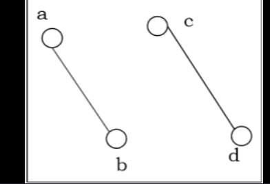

### fully Connected graph
- total no of req. edges is  nC~2~  or n*(n-1)/2

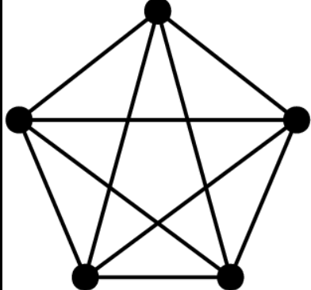

# Representation of Graph 
## 1. Using AdjMatrix 
Using 2D matrix use represent in which if any edge is present
in b/w the node(V->U) which is represent by adjMat[v][u]=1 and if not any edge is present than it is adj[v][u] = 0
it take **O(v2)** space and time complexity.

- > It store that information also that in between the node there is **no any edges**

 It take time to **add a new edge is O(1)**

 it take  time to **remove a edge is O(1)**

 it take  time to **seaarch a edge existence is O(1)**
 >**If graph is very dance(no of edges are maximum) then uses adjMat Rep**
 
 > But in the maximum cases uses adjList graph
### Code

```cpp
// take input no of vertex and edges
int vertex , edges;
cin>>vertex>>edges;
// init a 2D matrix of vertex*vertex
vector<vector<int>>adjMat(vertex,vector<int>(vertex,0));

int v , u ,wt;
for(int i =0;i<edges;i++){
    cin>>v>>u>>wt;
    // this is for the undirected graph
    adjMat[v][u] = wt;
    adjMat[u][v] = wt;
}


```

## 2. Using adjList 
- In which we init using vector of array or vector of list
for the weighted graph uses pair of list/ array for the representation.
- it take **O(V+2E) == O(V+E)  Time complexity**.
- it take **O(V+E) space complexity** in worst case when graph is 
  fully connected than it take **O(v2)** space.

It take time to **add a new edge is O(1)**

 it take  time to **remove a edge is O(N)** but using STL can be reduce in **O(1)**

 it take  time to **seaarch a edge existence is O(N)** but using STL can be reduce in O(1)
 >**When graph is Sparce (vertex has limited edge ) then uses adjList Rep** Ex. facebook 
 
 > It uses Maximum.
 

### if follow this type of syntex
```cpp
adjList[v].push_bacK(u);
adjList[u].push_back(v);
```


### code for undirected unweighted Graph
```cpp
// take input no of vertex and edges
int vertex,edges;
cin>>vertex>>edges;
vector<int>adhList[Vertex];

int u,v;
for(int i =0;i<edges;i++){

    cin>>u>>v;
    // for undirected graph
    adjList[v].push_bacK(u);
    adjList[u].push_back(v);
}

// for printing

for(int i =0;i<vertex;i++){
    cout<<i<<"->";
    for(int j =0;j<adj[i].size();i++)
    cout<<adj[i][j]<<" ";
    cout<<endl;
}
```
### Code for Undirected weighted graph
```cpp
int vertex,edges;
cin>>vertex>>edges;
vector<pair<int,int>>adjList[vertex];
int u ,v,wt;
for(int i =0;i<edges;i++){
    cin>>u>>v>>wt;
    adjList[u].push_back({v,wt});
    adjList[v].push_back(make_pair(u,wt));
}
// for printing same adjList[i][j].first 
```

> # Questions
---

# 01. Number of Total Possible Graph
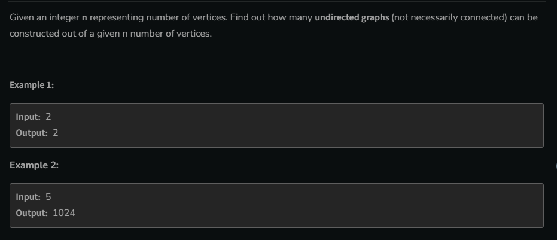

```cpp
long long Solve(int n ){
    long long ans;
    ans = pow(2,n*(n-1)/2);
    return ans;
}
```

# 02. Print AdjList

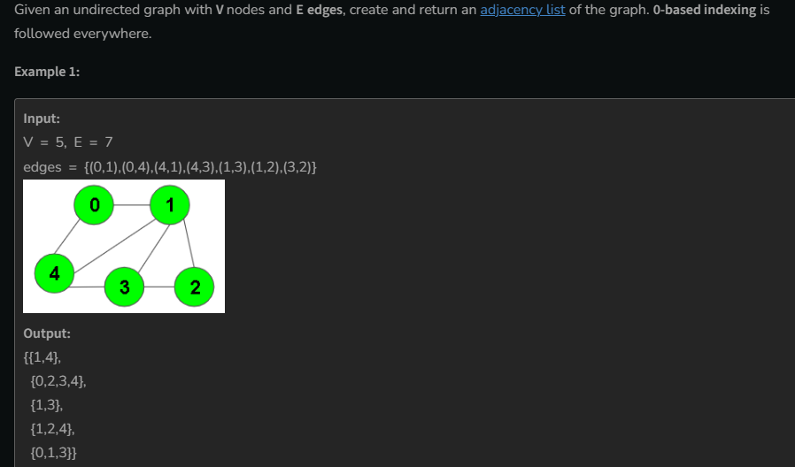

- Represention of Graph in AdjList form

```cpp

vector<vector<int>> Solve(vectro<pair<int,int>>edge , int V){
    // make a 2D vector of size v
    //  vector<vector<int>>adjList(V, vector<int>(0));

     vector<vector<int>>adjList(V);
    
    for(int i =0;i<edge.size();i++){
        int v = edge[i].first;
        int u = edge[i].second;
        // it's is a undirected graph
        adjList[v].push_back(u);
        adjList[u].push_back(v);
    }

  
    return adjList;
}

```
# BFS of a graph
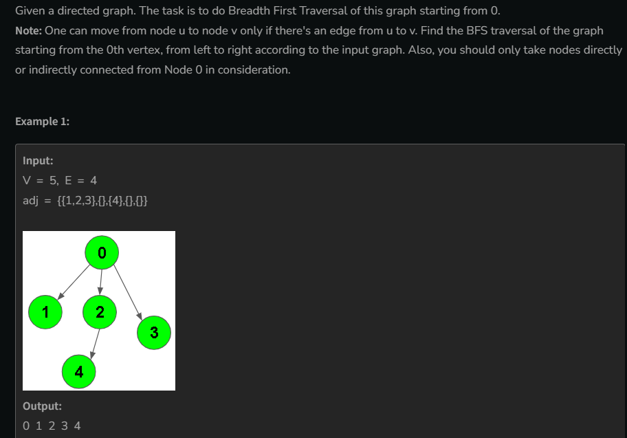


**BFS** uses queue Data Structre
```cpp
vector<int>BFS(vector<int> adj[] , int V){
    // starting from point 0
    // make a queue
     queue<int>q;
    q.push(0);
    // make a visted array for check isViseted or not
    vector<bool>visited(V,0);
    visited[0] = 1;
    vector<int>ans;

    while(!q.empty()){
        int parent = q.front();
        // remove the Parent from the queue
         q.pop();
        ans.push_back(parent);
        
       // traverse all the child of this parent
        for(int child =0;child<adj[parent].size();child++){
          if(!visited[adj[parent][child]])
          {
            q.push(adj[parent][child]);
           visited[adj[parent][child]] = 1;
          }
        }
    }

return ans;
}

```
# DFS 
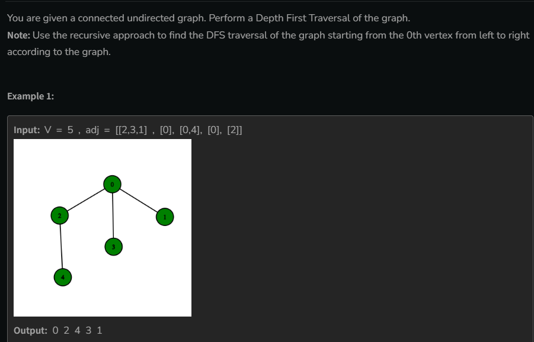

## recursion code
```cpp
// function for dfs
void dfs(int node , vector<int>&ans , vector<bool>&visited , vector<int>&adj[]){
    // make visited to node
    visited[node] = true;
    // store in ans
    ans.push_back(node);
    // visit all unvisted naebhour of node
    for(int child = 0;child<adj[node].size();child++){
        if(!visited[adj[node][child]])
        dfs(adj[node][child],ans,visited, adj);
    }
}

vector<int> dfsOfGraph(int V, vector<int> adj[]) {
        // make a visited vector
        vector<bool>visited(V,0);
        vector<int>ans;
        solve(0, ans,visited, adj);
        return ans;
        
    }

```
## Stack code  // important
```cpp
vector<int>dfsOfGraph(int V , vector<int>adj[]){
    vector<bool>vis(V,0);
    stack<int>st;
    vector<int>ans;
    st.push(0);
    while(!st.empty()){
        int node = st.top;
        st.pop();
        if(!vis[node]){
            vis[node]=1;
            ans.push_back(node);
            // graph reaf left to right in ans 
            // note ans can be diff
            for(int i = adj[node].size();i>=0;i--)
            st.push(adj[node][i]);
        }
    }
return ans;
}
```
*********************************************************


# **Graph Traversing**

 two type of traversing , BFS & DFS
 
 ## 1.BFS
 its kowns as level order traversing. 
 ```cpp

vector<int>BFS(vector<int>adjList[],int V){
    vector<int>bfs;
    // make V size vecor to check node is visited or not
    vector<bool>visited(V,0);
    // start traversing form 0
    queue<int>q;
    q.push(0);
    //  mark it visited

    while(!q.empty()){
        int parent = q.front();
        // remove first element;
        q.pop();
        // store in ans vector
        bfs.push_back(parent);
        // traverse all child of this parent
        for(int child =0;child<adj[parent].size();child++){
            if(!visited[adjList[parent][child]]){
                visited[adjList[parent][child]]=1;
                q.push(adjList[parent][child]);
            }
        }
    }

}
 ```

## 2. DFS 
 - it will visit all unvisited neabhour one by one.

or
 - take one way , and go to the extrime position if last than return , if already visit than not take this path return at same path.
 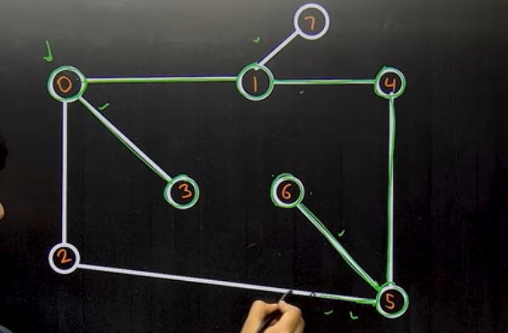

time complexity O(V+2E)==O(V+E);
space complexity O(V)
 ### Recursion Code

 ```cpp

 void DFS(int node , vector<int>&adj[],vector<int>&visited , vector<int>&ans){
      visited[node]=1;
      ans.push_back(node);
      for(int i =0;i<adj[node].size();i++){
        if(!visited[adj[node][i]]){
            DFS(adj[node][i],adj , visited,ans);
        }
      }
 }

 ```
- dfs code can right using stack , 
> which code can be write using recursion ,
this can be also write using stack also

```cpp

vector<int>dfs(vector<int>adj[],int V){
    vecotor<int>ans;
    // make a stack 
    stack<int>st;
    // make a visit vector
    vecotr<int>vis;
    // traversing start form the 0;
    st.push(0);
    while(!st.empty()){
        int node = st.top();
        st.pop();
        if(!vis[node]){
            // make visited
            vis[node]=1;
            ans.push_back(node);
            // ans is read left to riight
            for(int i = adj[node].size();i>=0;i--){
                  st.push(adj[node][i]);
            }
        }
    }
    return  ans;
}

```
--- 

# Cycle Dedection in a Graph
## 1. using DFS 
- Logic , if we vist a node which is already visited then we  can sey that in which a cycle is present, but but but 
it can give worng ans , when it vist it's parent at same time .
**Change logic** we apply dfs but current node will not visit it's parent node.

### code
```cpp
bool solve(vector<int>adj[],vector<bool>&vis,int node , int parent){
   vis[node]=1;
        for(int i =0;i<adj[node].size();i++){
            // when next node is parent node
            if(adj[node][i]==parent)
             continue;
            // when next node is already visted
            if(vis[adj[node][i]])
              return 1;
            // next node is not visted 
            if(solve(adj,vis,adj[node][i],node))
             return 1;
        }
        return false;
}
    
    bool isCycle(int V, vector<int> adj[]) {
        
      vector<bool>vis(V,0);
      return solve(adj , vis , i , -1);
    }

```
**Note this code give worng ans**

this code is only work for **Connected** graph not for disconnected.
so we modefiy the code 
- we will call the function for every node if any node give true ans
then in this graph cycle will present or not

### Correct code
```cpp
ool solve(vector<int>adj[],vector<bool>&vis,int node , int parent){
   vis[node]=1;
        for(int i =0;i<adj[node].size();i++){
            if(adj[node][i]==parent)
             continue;
            if(vis[adj[node][i]])return 1;
            
            if(solve(adj,vis,adj[node][i],node))
            return 1;
        }
        return false;
}
    
    bool isCycle(int V, vector<int> adj[]) {
        
      vector<bool>vis(V,0);
      for(int i =0;i<V;i++){
          if(!vis[i]&&solve(adj , vis , i , -1))
           return 1;
    }
    return false;}
```
time complexity = O(v+E);

---
